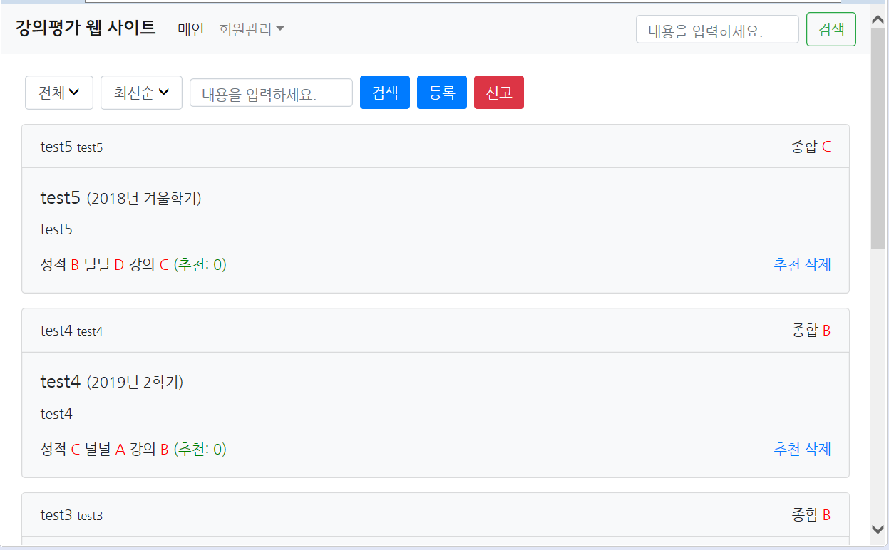
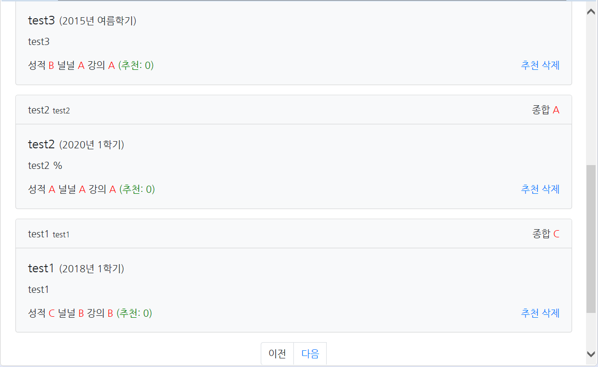
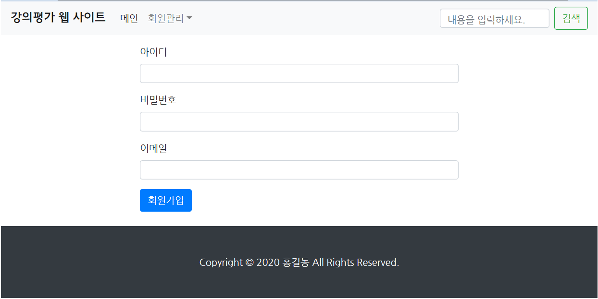
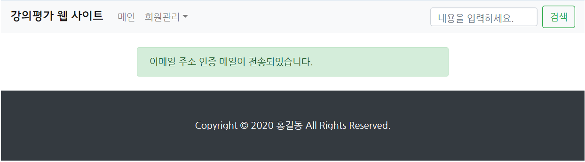
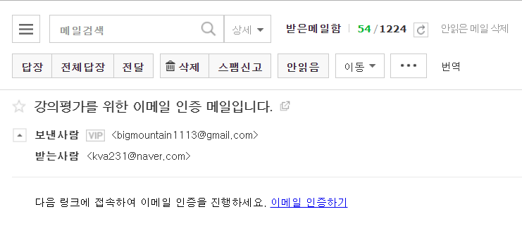
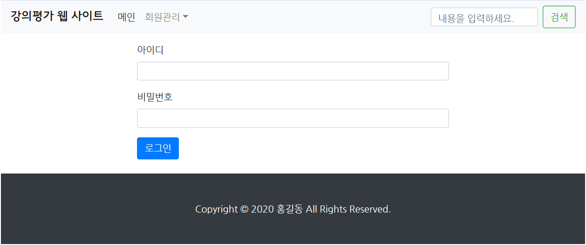
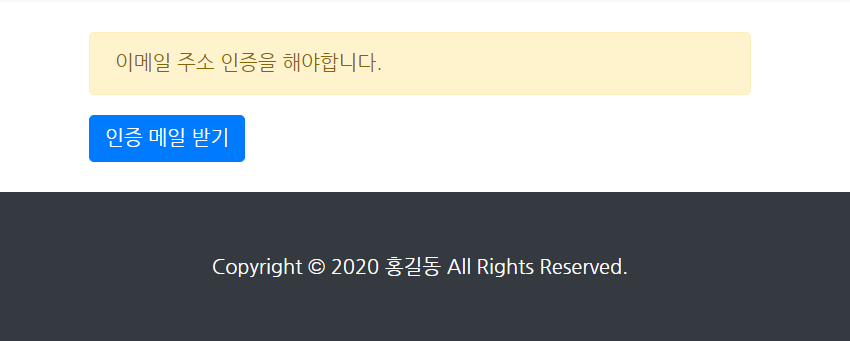
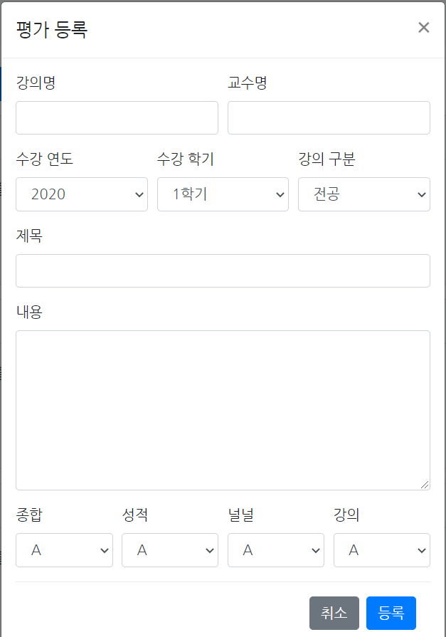
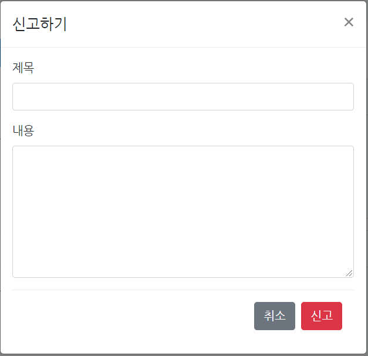
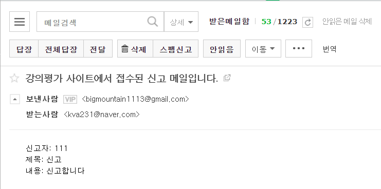

# JSP-Lecture-Evaluation-Service

## 강의 평가 웹 사이트
> ### ● 메인 페이지  
>   
>   
> **메인**을 누르면 메인 페이지으로 이동합니다.  
> **회원관리**를누르면 로그아웃이 표시됩니다.  
> 검색란에 내용을 입력 후 **검색** 버튼을 누르면 내용과 관련된 글 목록이 표시됩니다.  
> 검색할 때 **과목 구분**(전체, 전공, 교양, 기타)과 **정렬 순서**(최신순, 추천순)를 선택하고 검색할 수 있습니다.  
> **등록** 버튼을 누르면 강의 평가 글을 작성할 수 있는 양식이 표시됩니다.  
> **신고** 버튼을 누르면 신고 글을 작성할 수 있는 양식이 표시됩니다.  
> 사용자는 강의 평가 글을 **추천**할 수 있으나 중복 추천은 불가능합니다.  
> 강의 평가 글은 글 작성자만 **삭제**할 수 있습니다.  
> 하단에 있는 **이전** 버튼을 누르면 이전 페이지로, **다음** 버튼을 누르면 다음 페이지로 이동합니다.  
> 메인 페이지에는 페이지당 최대 5개의 강의 평가 글이 표시됩니다.
>  
> ※ 메인 페이지는 로그인과 메일 인증 절차를 거쳐야 볼 수 있습니다.
  
> ### ● 회원가입 페이지
>   
> 아이디, 비밀번호, 이메일을 차례대로 입력하고 **회원가입** 버튼을 누르면 회원가입이 완료됩니다.  
> 모든 항목은 빠짐없이 입력해야 합니다.  
> 회원가입이 완료되면 로그인 된 채로 이메일 전송 페이지로 이동합니다.
  
> ### ● 이메일 전송 페이지
>   
>  
>   
> 회원가입 페이지에서 입력한 이메일로 인증 메일이 전송됩니다.  
> 사용자는 **이메일 인증하기** 링크를 눌러 이메일 인증을 해야 합니다.  
> 인증이 완료되면 로그인 된 채로 메인 페이지로 이동합니다.
  
> ### ● 로그인 페이지
>   
> 아이디, 비밀번호를 차례대로 입력하고 **로그인** 버튼을 누르면 로그인이 완료됩니다.  
> 모든 항목은 빠짐없이 입력해야 합니다.  
> 로그인이 완료되면 로그인된 채로 메인 페이지로 이동합니다.  
>  
> ※ 이메일 인증이 되지 않은 사용자일 경우 이메일 인증 페이지로 이동합니다.
  
> ### ● 이메일 인증 페이지
>   
> 회원가입 후 이메일 인증을 하지 않은 사용자만 이 페이지가 표시됩니다.  
> **인증 메일 받기** 버튼을 누르면 인증 메일을 받을 수 있습니다.  
> 인증이 완료되면 로그인 된 채로 메인 페이지로 이동합니다.
  
> ### ● 강의 평가 글 양식
>   
> **수강 연도**는 2011 ~ 2023 중 선택할 수 있습니다.  
> **수강 학기**는 1학기, 여름학기, 2학기 겨울학기 중 선택할 수 있습니다.  
> **강의 구분**은 전공, 교양, 기타 중 선택할 수 있습니다.  
> **종합, 성적, 널널, 강의**는 A, B, C, D, F 중 선택할 수 있습니다.  
> **종합**은 강의에 대한 종합적인 평가를, **성적**은 점수를 잘 받을 수 있는지에 대한 정도를, **널널**은 수업이 얼마나 여유로운지를, **강의**는 수업이 얼마나 유익한지를 평가하는 척도가 됩니다.  
> 강의명, 교수명, 제목, 내용 등을 입력하고 **등록** 버튼을 누르면 글이 등록됩니다.  
> 모든 항목은 빠짐없이 입력해야 합니다.  
> 글이 등록되면 들록된 글이 메인 페이지에서 표시됩니다.
  
> ### ● 신고 글 양식
> 
>  
>   
> 제목, 내용을 입력하고 **신고** 버튼을 누르면 신고가 접수됩니다.  
> 모든 항목은 빠짐없이 입력해야 합니다.  
> 신고가 접수되면 관리자에게 작성자와 작성내용이 담긴 메일이 전송됩니다.
  
## 참고
> * Youtube강좌: <https://www.youtube.com/watch?v=hke9FKluXow&list=PLRx0vPvlEmdAdWCQeUPnyMZ4PsW3dGuFB>
